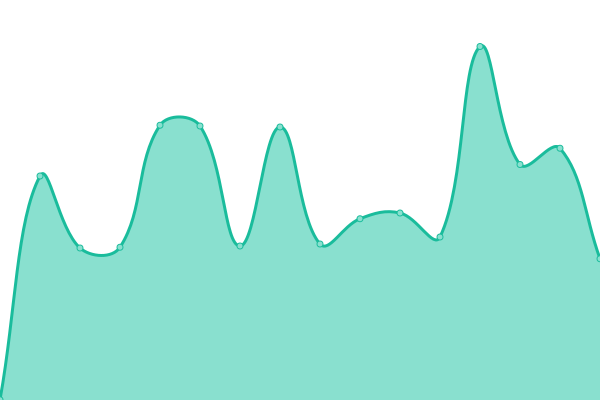
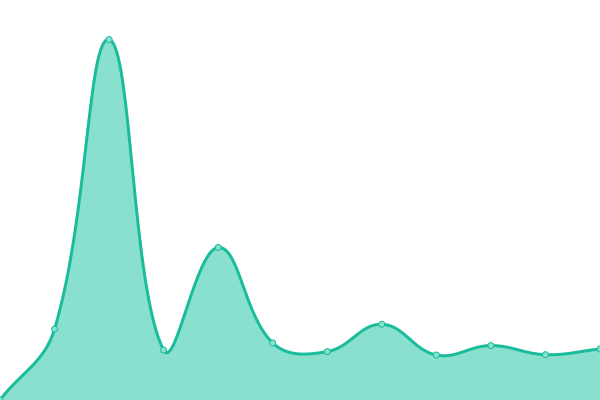
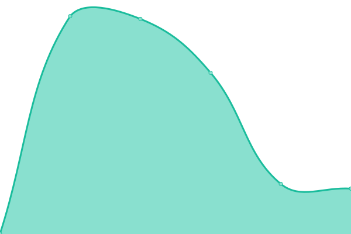
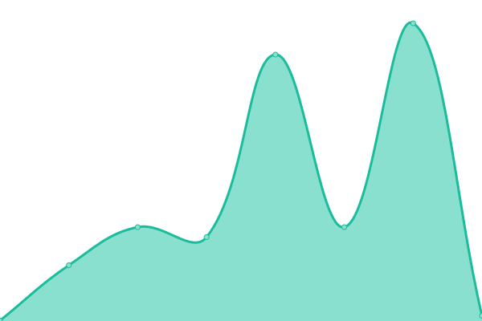

# [📈 Live Status](https://demo.upptime.js.org): <!--live status--> **🟩 All systems operational**

This repository contains the open-source uptime monitor and status page for [Upptime](https://upptime.js.org), powered by [Upptime](https://github.com/upptime/upptime).

With [Upptime](https://upptime.js.org), you can get your own unlimited and free uptime monitor and status page, powered entirely by a GitHub repository. We use [Issues](https://github.com/upptime/upptime/issues) as incident reports, [Actions](https://github.com/DimGTHUB/Statuts-de-mes-outils/actions) as uptime monitors, and [Pages](https://demo.upptime.js.org) for the status page.

<!--start: status pages-->
<!-- This summary is generated by Upptime (https://github.com/upptime/upptime) -->
<!-- Do not edit this manually, your changes will be overwritten -->
<!-- prettier-ignore -->
| URL | Status | History | Response Time | Uptime |
| --- | ------ | ------- | ------------- | ------ |
|  [📂 Outils : Wrike](https://www.wrike.com/) | 🟩 Up | [outils-wrike.yml](https://github.com/DimGTHUB/Statuts-de-mes-outils/commits/HEAD/history/outils-wrike.yml) | 

 167ms
     
 | 

<a href="https://DimGTHUB.github.io/Statuts-de-mes-outils/history/outils-wrike">100.00%</a>
    

|  [🏭 Métier : Lomaco Régulation](https://keolis.mycaelis.fr/regulation/) | 🟩 Up | [metier-lomaco-regulation.yml](https://github.com/DimGTHUB/Statuts-de-mes-outils/commits/HEAD/history/metier-lomaco-regulation.yml) | 

 848ms
     
 | 

<a href="https://DimGTHUB.github.io/Statuts-de-mes-outils/history/metier-lomaco-regulation">99.38%</a>
    

|  [🏭 Métier : Lomaco Gestion Temps](https://keolisgdt.mycaelis.fr/gestiondutemps/) | 🟩 Up | [metier-lomaco-gestion-temps.yml](https://github.com/DimGTHUB/Statuts-de-mes-outils/commits/HEAD/history/metier-lomaco-gestion-temps.yml) | 

 2141ms
     
 | 

<a href="https://DimGTHUB.github.io/Statuts-de-mes-outils/history/metier-lomaco-gestion-temps">68.01%</a>
    

|  [🏭 Métier : Kopilot](https://prod.kopilot.apps.localsolver.com/login) | 🟩 Up | [metier-kopilot.yml](https://github.com/DimGTHUB/Statuts-de-mes-outils/commits/HEAD/history/metier-kopilot.yml) | 

 724ms
     
 | 

<a href="https://DimGTHUB.github.io/Statuts-de-mes-outils/history/metier-kopilot">100.00%</a>
    

|  [🌐 Passerelles : SPS](https://www.sirusps.fr/Transporteur-Beta-1?redirection=1&group=TR-00002) | 🟩 Up | [passerelles-sps.yml](https://github.com/DimGTHUB/Statuts-de-mes-outils/commits/HEAD/history/passerelles-sps.yml) | 

 728ms
     
 | 

<a href="https://DimGTHUB.github.io/Statuts-de-mes-outils/history/passerelles-sps">99.03%</a>
    

|  [🌐 Passerelles : Speedcall](https://speedcall.itineraire.app/login) | 🟩 Up | [passerelles-speedcall.yml](https://github.com/DimGTHUB/Statuts-de-mes-outils/commits/HEAD/history/passerelles-speedcall.yml) | 

 601ms
     
 | 

<a href="https://DimGTHUB.github.io/Statuts-de-mes-outils/history/passerelles-speedcall">100.00%</a>
    

|  [☎️ Prise d'appel : Komand](https://crc.keolis-sante.fr/) | 🟩 Up | [prise-d-appel-komand.yml](https://github.com/DimGTHUB/Statuts-de-mes-outils/commits/HEAD/history/prise-d-appel-komand.yml) | 

 334ms
     
 | 

<a href="https://DimGTHUB.github.io/Statuts-de-mes-outils/history/prise-d-appel-komand">100.00%</a>
    

<!--end: status pages-->

[**Visit our status website →**](https://demo.upptime.js.org)

## 📄 License

- Powered by: [Upptime](https://github.com/upptime/upptime)
- Code: [MIT](./LICENSE) © [Anand Chowdhary](https://anandchowdhary.com), supported by [Pabio](https://pabio.com)
- Data in the `./history` directory: [Open Database License](https://opendatacommons.org/licenses/odbl/1-0/)
