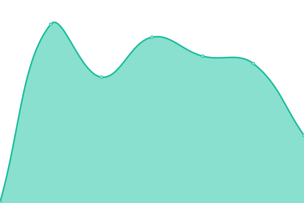
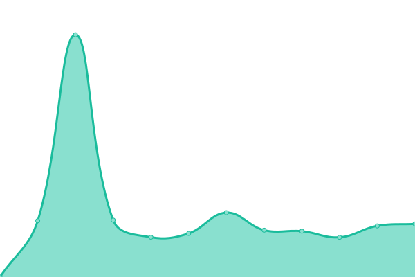

# [📈 Live Status](https://demo.upptime.js.org): <!--live status--> **🟧 Partial outage**

This repository contains the open-source uptime monitor and status page for [Upptime](https://upptime.js.org), powered by [Upptime](https://github.com/upptime/upptime).

With [Upptime](https://upptime.js.org), you can get your own unlimited and free uptime monitor and status page, powered entirely by a GitHub repository. We use [Issues](https://github.com/upptime/upptime/issues) as incident reports, [Actions](https://github.com/DimGTHUB/Statuts-de-mes-outils/actions) as uptime monitors, and [Pages](https://demo.upptime.js.org) for the status page.

<!--start: status pages-->
<!-- This summary is generated by Upptime (https://github.com/upptime/upptime) -->
<!-- Do not edit this manually, your changes will be overwritten -->
<!-- prettier-ignore -->
| URL | Status | History | Response Time | Uptime |
| --- | ------ | ------- | ------------- | ------ |
|  [Wrike](https://www.wrike.com/) | 🟩 Up | [wrike.yml](https://github.com/DimGTHUB/Statuts-de-mes-outils/commits/HEAD/history/wrike.yml) | 

 203ms
     
 | 

<a href="https://DimGTHUB.github.io/Statuts-de-mes-outils/history/wrike">100.00%</a>
    

|  [Lomaco Online - Régulation](https://keolis.mycaelis.fr/regulation/) | 🟩 Up | [lomaco-online-regulation.yml](https://github.com/DimGTHUB/Statuts-de-mes-outils/commits/HEAD/history/lomaco-online-regulation.yml) | 

 828ms
     
 | 

<a href="https://DimGTHUB.github.io/Statuts-de-mes-outils/history/lomaco-online-regulation">100.00%</a>
    

|  [Lomaco Online - Gestion du Temps](https://keolisgdt.mycaelis.fr/gestiondutemps/) | 🟩 Up | [lomaco-online-gestion-du-temps.yml](https://github.com/DimGTHUB/Statuts-de-mes-outils/commits/HEAD/history/lomaco-online-gestion-du-temps.yml) | 

 1060ms
     
 | 

<a href="https://DimGTHUB.github.io/Statuts-de-mes-outils/history/lomaco-online-gestion-du-temps">42.49%</a>
    

|  [KS SLV - Clisson](185.15.26.36) | 🟥 Down | [ks-slv-clisson.yml](https://github.com/DimGTHUB/Statuts-de-mes-outils/commits/HEAD/history/ks-slv-clisson.yml) | 

 0ms
     
 | 

<a href="https://DimGTHUB.github.io/Statuts-de-mes-outils/history/ks-slv-clisson">93.76%</a>
    

<!--end: status pages-->

[**Visit our status website →**](https://demo.upptime.js.org)

## 📄 License

- Powered by: [Upptime](https://github.com/upptime/upptime)
- Code: [MIT](./LICENSE) © [Anand Chowdhary](https://anandchowdhary.com), supported by [Pabio](https://pabio.com)
- Data in the `./history` directory: [Open Database License](https://opendatacommons.org/licenses/odbl/1-0/)
